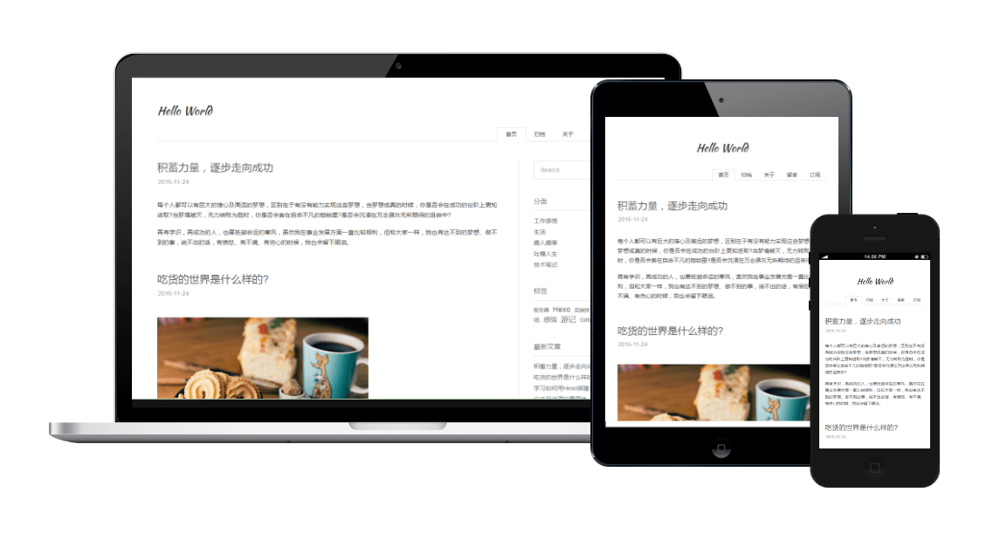

# Maupassant Hexo

Maupassant是一个简单的Hexo模板，由`Cho`为Typecho设计的一套响应式模板，看到很多博主各自在这套模板上进行了扩展，所以借鉴很多博主移植Maupassant的一些功能，在此基础上进行移植与修改.

[演示地址](http://sevennight.cc)
### 2017-07-17 更新
 - 多说挂了，删除跟多说相关的所有配置
 - 修改归档显示方式，全站目录模式下查看全站目录结构（之前带有分页），分类和标签目录模式下，查看分类和标签的所有目录，如需要归档带分页，请到主题文件夹下修改`archive.jade`，里面有修改说明
 - 文章发布日期展示格式由之前的鸟语格式改为为yyyy-MM-dd
 - 文章段落间隔样式优化，移动端屏幕尺寸字体优化，文章标注样式优化
 


## 安装  

安装主题：
```
$ git clone https://github.com/7ye/maupassant-hexo.git
$ npm install hexo-renderer-jade --save
```
改变Hexo配置文件 `_config.yml` 修改配置 `theme` 为 `maupassant-hexo`

## 主题配置  

```
fancybox: true ## 是否启用Fancybox图片灯箱效果 true/false.
disqus:  ## disqus用户名，为空则不使用
google_search: true ## 使用google搜索引擎, true/false.
baidu_search: ## 使用百度搜索引擎, true/false.
google_analytics: ## Google统计ID
baidu_analytics: ## 百度统计ID
show_category_count: true ## 如果你想显示侧边栏分类下的文章数量，请设置值为true
busuanzi: true ## 使用不蒜子统计文章访问量 true/false

## 头部菜单
menu: 
  - page: home
    directory: .
  - page: archive
    directory: archives/
  - page: about
    directory: about/
  - page: rss
    directory: atom.xml

## 侧边栏小工具设置: search, category, tag, recent_posts, links
widgets:
  - search
  - category
  - tag
  - recent_posts
  - links

## 侧边栏链接
links: 
  - title: 标题
    url: http://www.example.com

## 静态文件目录
js: js
css: css

## 主题版本
version: 0.0.1

```

 - fancybox：是否启用[Fancybox](http://fancyapps.com/fancybox/)图片灯箱效果
 - disqus：[Disqus评论](https://disqus.com/) shortname
 - google_search：默认使用Google搜索引擎
 - baidu_search：若想使用百度搜索，将其设定为`true`
 - google_analytics：[Google Analytics](https://www.google.com/analytics/) 跟踪ID
 - baidu_analytics：[百度统计](http://tongji.baidu.com/) 跟踪ID
 - show_category_count：是否显示侧边栏分类数目
 - busuanzi：是否使用[不蒜子](http://busuanzi.ibruce.info/)页面访问计数
 - menu：自定义页面及菜单，依照已有格式填写。填写后请在`source`目录下建立相应名称的文件夹
 - widgets：选择和排列希望使用的侧边栏小工具
 - links： 友情链接，请依照格式填写。
 - 静态文件目录：静态文件存储路径，方便设置CDN缓存
 - version：主题版本，便于静态文件更新后刷新CDN缓存

## 主题特性

### 文章摘要
首页默认显示文章摘要而非全文，可以在文章的`front-matter`中填写一项`description:`来设置你想显示的摘要，或者直接在文章内容中插入`<!--more-->`以隐藏后面的内容。
若两者都未设置，则自动截取文章第一段作为摘要。

### description描述
对于首页的`description`，可在Hexo下的配置文件`_config.yml`下配置`description`参数，对于文章，可在`front-matter`中填写一项`description:`来手动写描述，如果文章没有任何配置，则自动截取文章前150个字符为当前文章的`description`(不包括html标签)

### 添加页面
在`source`目录下建立相应名称的文件夹，然后在文件夹中建立`index.md`文件，并在`index.md`的`front-matter`中设置layout为`layout: page`。若需要单栏页面，就将layout设置为 `layout: single-column`。

### 文章评论
文章和页面的评论功能可以通过在`front-matter`中设置`comments: true`或`comments: false`来进行开启或关闭（默认开启）。

### 语法高亮
要启用代码高亮，请在Hexo目录的`_config.yml`中将`highlight`选项按照如下设置：

```
highlight:
  enable: true
  auto_detect: true
  line_number: true
  tab_replace:
```

### 数学公式
要启用数学公式支持，请在Hexo目录的`_config.yml`中添加：

```
mathjax: true
```

并在相应文章的`front-matter`中添加`mathjax: true`，例如：

```
---
title: Test Math
date: 1997-01-01 00:00:00
categories: math
mathjax: true
---
```

数学公式的默认定界符是`$$...$$`和`\\[...\\]`（对于块级公式），以及`$...$`和`\\(...\\)`（对于行内公式）。

但是，如果你的文章内容中经常出现美元符号“`$`”, 或者说你想将“`$`”用作美元符号而非行内公式的定界符，请在Hexo目录的`_config.yml`中添加：

```
mathjax2: true
```

而不是`mathjax: true`。 相应地，在需要使用数学公式的文章的`front-matter`中也添加`mathjax2: true`

### 支持语言
目前支持简体中文（zh-CN），需其他语言支持在主题目录下`languages`，按照已有配置文件对照着规则添加`yml`配置文件即可
